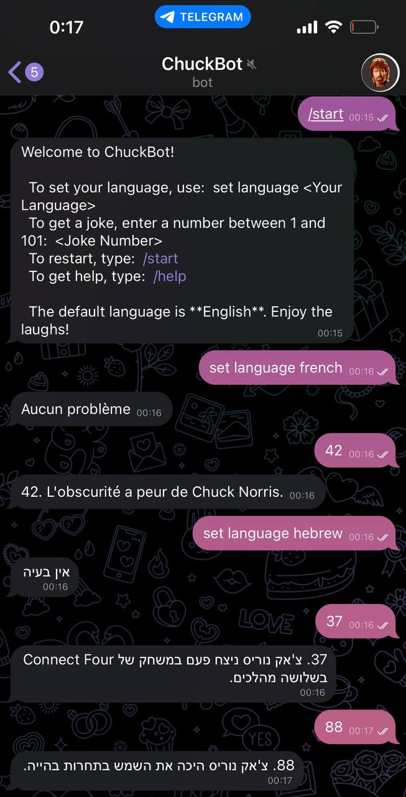

# ChuckBot - Telegram Bot
ChuckBot is a Telegram bot written in Node.js and JavaScript that provides users with Chuck Norris jokes.
The bot utilizes web scraping to extract jokes from the "101 Chuck Norris Jokes To Make You Laugh" website in real-time. Additionally, it leverages the Google Cloud Translate API
to translate jokes from English to the user's preferred language. ChuckBot is deployed on AWS.  

#  Features
*  Real-time web scraping to fetch Chuck Norris jokes.
*  Translation of jokes from English to the user's preferred language.
*  User-friendly commands for setting language and requesting jokes.
*  Deployed on AWS EC2 instance for easy accessibility.

# How To Use
Start a conversation with ChuckBot by visiting the bot's page: [@Chuck_9349_bot](https://t.me/chuck_1405_bot)

# Commands
*  set language Your Language - Set your preferred language.
*  JokeNumber - Fetch a Chuck Norris joke by entering a number between 1 and 101.
*  /start - Restart ChuckBot.
*  /help - Shows a list of all valid commands.

# Screenshot

  
